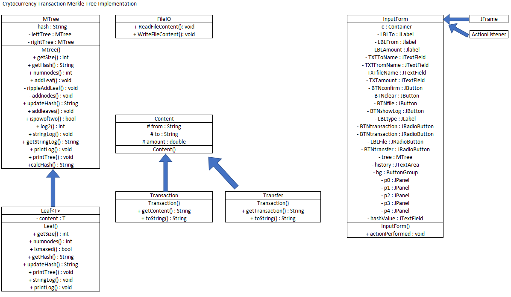

# MerkleTree314
Cryptocurrency Security Implementation

Gregory Petri & Nicholas Saldana

Using Java via Eclipse IDE

Video: https://github.com/gcpetri/MerkleTree314  

**Documentation**

__To use the interface:__

* Create a MTree class instance 
`MTree<Content> tree = new MTree<Content>();` 
* Create an InputForm class instance 
`InputForm i = new InputForm(tree);` 
* Run the program 

__To use the raw MTree class:__

* Create a MTree class instance 
`MTree<Content> tree = new MTree<Content>();` 
* Create (a) Transaction or Transfer class instance 
`Transaction tr = new Transaction("Greg", "Nick", 300.05);` 
`Transfer tf = new Transfer("Lupoli", 50);` 
* Use the MTree member functions (shown in below) to add and manipulate the merkle tree 

__MTree Member Function Syntax & Semantics:__
* returns (int) amount of leaf nodes in the tree 
`tree.getSize()` 
* returns the tree root hash (String) 
`tree.getHash()` 
* returns the tree number of nodes (int) 
`tree.numnodes()` 
* adds leaves (Transactions or Transfers in an ArrayList<T>) to the tree (void) 
`tree.addLeaves(ArrayList<T>)` 
* adds one leaf (Transaction or Transfer) to the tree (void)  
`tree.addLeaf(T t)` 
* returns (String) and updates the hash of the whole tree - use if hash is incorrect or lagging 
`tree.updateHash()` 
* returns (boolean) true if the tree is holding the maximum number of external nodes (leaves) 
`tree.isMaxed()` 
* prints the tree (pre-order) to System.out (void) 
`tree.printTree(0)` 
* prints a log of all leaves to System.out (void) 
`tree.printLog()` 
* returns (String) a log of all leaves 
`tree.getStringLog()` 
* returns (boolean) true if the integer parameter is a power of two 
`tree.ispowoftwo(int)` 
* returns (int) the log of the integer parameter 
`tree.log(int)` 
* returns (String) the hash of the String parameter - use to see an example of the hash function 
`tree.calcHash(String)` 

__UML:__ 
 

 
__Tree Layout:__ 
 

 
